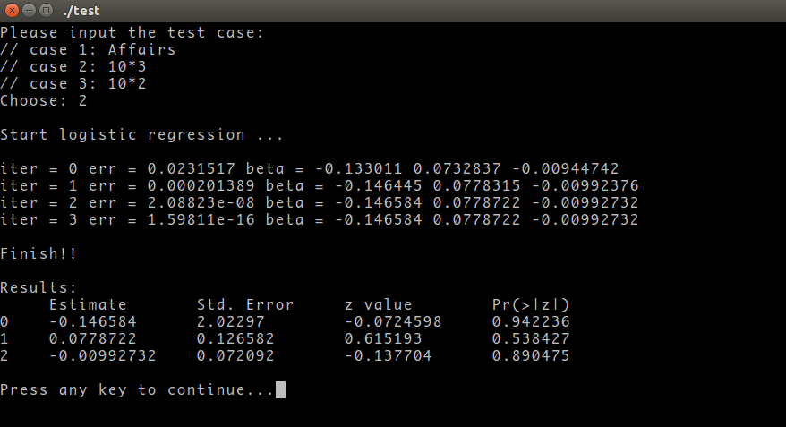

## Example: Affairs

```{r}
rm(list=ls())
library(AER)
data(Affairs, package='AER')
summary(Affairs)
table(Affairs$affairs)

## the binary outcome is of interest
Affairs$ynaffair[Affairs$affairs > 0] <- 1
Affairs$ynaffair[Affairs$affairs == 0] <- 0


## write data to file
con <- file(description="ynaffair.dat", open="wb")
writeBin(object=as.double(Affairs$ynaffair), con=con)
close(con)


Affairs$ynaffair <- factor(Affairs$ynaffair,
                           levels = c(0, 1),
                           labels = c("NO", "Yes"))
table(Affairs$ynaffair)

## full logistic regression model
fit.full <- glm(ynaffair ~ gender + age + yearsmarried + children + religiousness + education + occupation + rating, data = Affairs, family = binomial())
summary(fit.full)

## reduced model
fit.reduced <- glm(ynaffair ~ age + yearsmarried + religiousness + rating, data = Affairs, family = binomial())
summary(fit.reduced)
## fit.reduced <- glm(ynaffair ~ age + yearsmarried + religiousness + rating, data = Affairs, family = poisson)
## summary(fit.reduced)


## write data to file

df <- as.matrix(Affairs[c(3,4,6,9)])
N = 601
con <- file(description="x.dat", open="wb")
for(i in 1:N){
    writeBin(object=as.vector(as.double(c(1, df[i,])), mode = "numeric"), con=con)
}
close(con)


## compare two model
anova(fit.reduced, fit.full, test = 'Chisq')


## The nonsignificant chi-square value suggests that the reduced model fits as well as the full model.


## ##########################
## Model Parameters
## ##########################
coef(fit.reduced)
exp(coef(fit.reduced))

## ##########################
## Predict
## ##########################

testdata <- data.frame(rating=c(1, 2, 3, 4, 5), age=mean(Affairs$age),
                       yearsmarried=mean(Affairs$yearsmarried),
                       religiousness=mean(Affairs$religiousness))

testdata$prob <- predict(fit.reduced, newdata=testdata, type="response")
testdata


## ##########################
## overdispersion
##
## Overdispersion occurs when the observed variance of the response variable is
## larger than what would be expected from a binomial distribution.
##
## One way to detect overdispersion is to compare the residual deviance with the
## residual degrees of freedom in your binomial model.
##
## If the ratio phi, is considerably larger than 1, you have evidence of overdispersion.
## ##########################

phi = 615.4/596

## another way for testing Overdispersion

fit <- glm(ynaffair ~ age + yearsmarried + religiousness +
               rating, family = binomial(), data = Affairs)
fit.od <- glm(ynaffair ~ age + yearsmarried + religiousness +
                  rating, family = quasibinomial(), data = Affairs)
pchisq(summary(fit.od)$dispersion * fit$df.residual,
       fit$df.residual, lower = F)

## The resulting p-value is clearly not significant, strengthening our belief that Overdispersion is not a problem.

```


## Example: Artificial Data

### Using R

```{r}
## data
x = matrix(c(1, 10,25,1, 5, 27, 1, 8, 18,1,  11, 11,1, 12, 28, 1,14, 3,1,3, 6, 1,1, 30,1, 16, 26, 1,18, 22), byrow=T, ncol=3)
y = c(0, 0, 0, 0, 1, 1, 1, 1, 1, 1)
x1 = x[,2]
x2 = x[,3]
## logistic regression
model2  = glm(y~x1+x2, family = binomial())
summary(model2)
```

### Using cpp

The results of cpp program are as follows:




